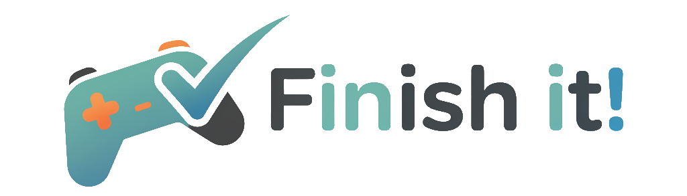
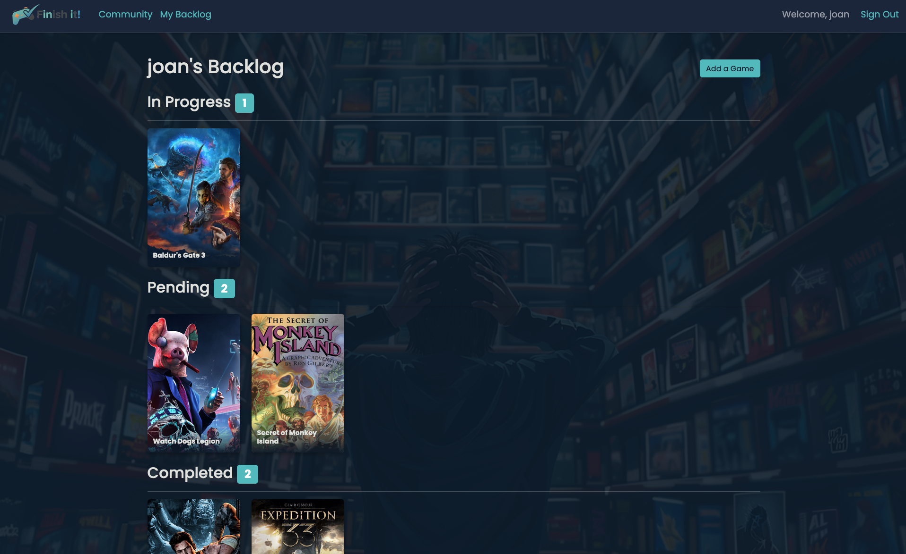

Finish-It is a web application designed for gamers to track their video game backlog, manage their collection, and see what the community is playing. Never lose track of a game you want to play again!

## Description

Are you a gamer with a "pile of shame" or a backlog of games that seems to grow endlessly? "Finish-It" is here to help. This application allows you to create a personalized list of games you own or want to play. You can update their status (e.g., "Playing", "Finished", "Dropped"), give them a rating, and keep notes. It's the perfect tool to organize your gaming life and finally conquer that backlog.

[**Live Demo**](https://finish-it-00564535a87d.herokuapp.com/) 

## Features

*   **Game Backlog Management:** Add games to your personal backlog and track their status.
*   **Game Discovery:** Browse and search for games to add to your list.
*   **Rating System:** Rate the games you've played to remember your favorites.
*   **Community View:** See what other users are playing and what's popular in the community.
*   **User Authentication:** Securely manage your personal game lists.

## Technologies Used

*   **Backend:** Node.js, Express.js
*   **Database:** MongoDB with Mongoose ODM
*   **Frontend:** HTML, CSS, JavaScript, Bootstrap
*   **Authentication:** Passport.js
*   **Templating Engine:** EJS
*   **Gaming Data:** [RAWG Video Games Database API](https://rawg.io/apidocs)

## Future Enhancements

Here are some ideas for future features:
*   **Expand API Integration:** Enhance the existing RAWG API integration to include more data points like "time to complete" and aggregated user ratings.
*   **Advanced Filtering and Sorting:** Allow users to filter their backlog by platform, genre, or status.
*   **Social Features:** Implement user profiles, the ability to follow other users, and comment on game pages.
*   **Wishlist Functionality:** Add a separate list for games users want to buy in the future.
*   **Mobile App:** Develop a mobile version of the application for on-the-go access.

## Attribution

*   Logo created with Perplexity AI.
*   Background image by "Sydney Louw Butler / How-To Geek / MidJourney".
*   Code assistance and guidance provided by Google's Gemini.
